# Premium Animated GitHub Profile Hero Banner 🚀

An ultra-premium, dynamic, and fully responsive GitHub Profile README hero banner built entirely in pure SVG using SMIL animations. 

Designed with modern design guidelines (Apple, Linear, Vercel) featuring glassmorphism, floating background glow, glowing interactive skill pills, moving scanline, custom ASCII portrait generated from a portrait photo, and a typing carousel terminal.

## Live Preview (Theme-Aware)

<picture>
  <source media="(prefers-color-scheme: dark)" srcset="dark.svg">
  <source media="(prefers-color-scheme: light)" srcset="light.svg">
  
</picture>

---

## ✨ Features

- **Pure SVG (No Javascript / No External Assets)**: Guaranteed to render on GitHub's raw view and main markdown processor since it complies with GitHub's CSP.
- **Dynamic Themes**: Separate `dark.svg` and `light.svg` customized for GitHub's native light and dark modes.
- **Micro-Animations**:
  - 🖼️ **ASCII Portrait**: Custom-compiled portrait from the user's photo with a line-by-line terminal rendering sequence, floating movement, CRT scanline, and color-shifting gradients.
  - 🖥️ **Interactive Terminal**: Custom terminal header with window controls, interactive directory paths, and a looped typing terminal displaying multiple roles (`Frontend Engineer`, `Full Stack Developer`, etc.).
  - 🫧 **Living Background**: Slow-drifting radial gradient spheres, floating particles/stars, and light-reflection glass sheen.
  - 🌈 **Border Shimmer**: Glowing linear gradient shimmers running continuously along the panel borders.
  - 🏷️ **Interactive Skills & Socials**: Skill pills that scale up and glow on hover, and minimal glowing social icons.

## 🛠️ How to Use

### 1. Host the SVGs
The SVGs are already hosted in your public repository **`07anishu12/Aniket`**.

### 2. Embed in your GitHub Profile README
To display the banner on your main GitHub Profile README (under repository `07anishu12/07anishu12`), add this snippet at the very top of your profile README file:

```html
<a href="https://www.linkedin.com/in/aniket-thakur-a23a9b372/" target="_blank">
  <picture>
    <source media="(prefers-color-scheme: dark)" srcset="https://raw.githubusercontent.com/07anishu12/Aniket/main/dark.svg">
    <source media="(prefers-color-scheme: light)" srcset="https://raw.githubusercontent.com/07anishu12/Aniket/main/light.svg">
    
  </picture>
</a>
```

> [!TIP]
> Wrapping the `<picture>` element in the anchor tag makes the entire banner clickable, allowing visitors to easily navigate to your LinkedIn profile.

---

## 🎨 Visual Details

### Dark Mode
- **Background**: `#030712` (Slate Black)
- **Glass Panels**: `#0F172A` (Slate 900) at `75%` opacity with blur and shadow.
- **Accents**: Cyan (`#22D3EE`), Violet (`#7C3AED`), Emerald (`#10B981`) gradient loops.

### Light Mode
- **Background**: `#FFFFFF`
- **Glass Panels**: `#F8FAFC` (Slate 50) at `85%` opacity with soft shadow.
- **Accents**: Blue (`#2563EB`), Cyan (`#06B6D4`), Emerald (`#10B981`) gradient loops.

---
Designed with ❤️ by Antigravity for [07anishu12](https://github.com/07anishu12).
